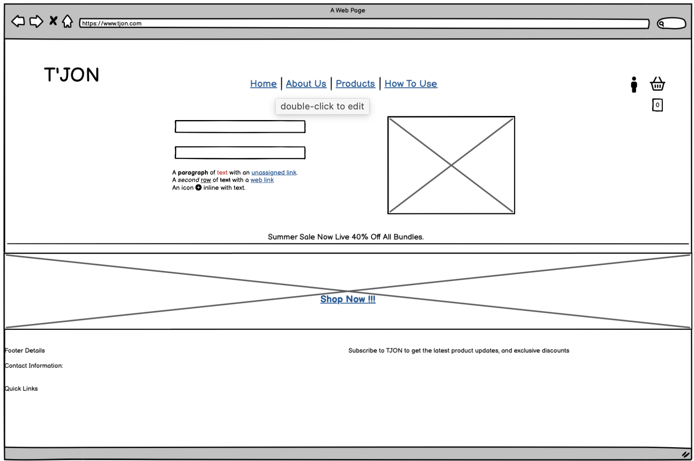
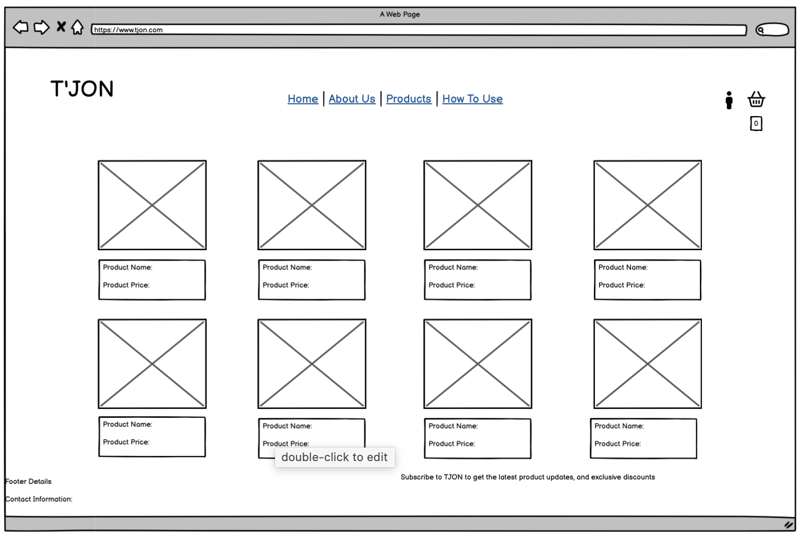
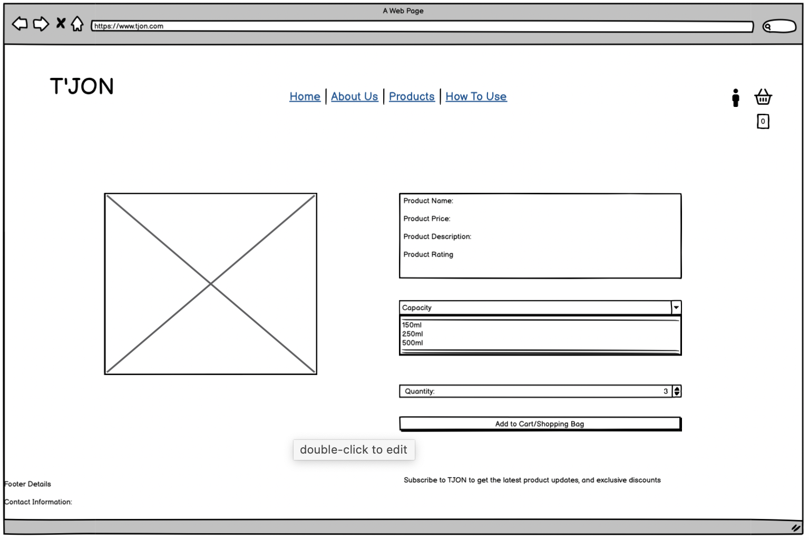
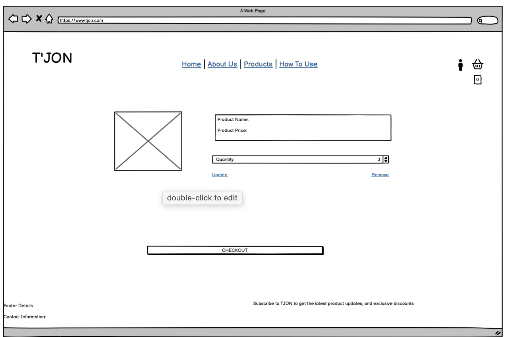
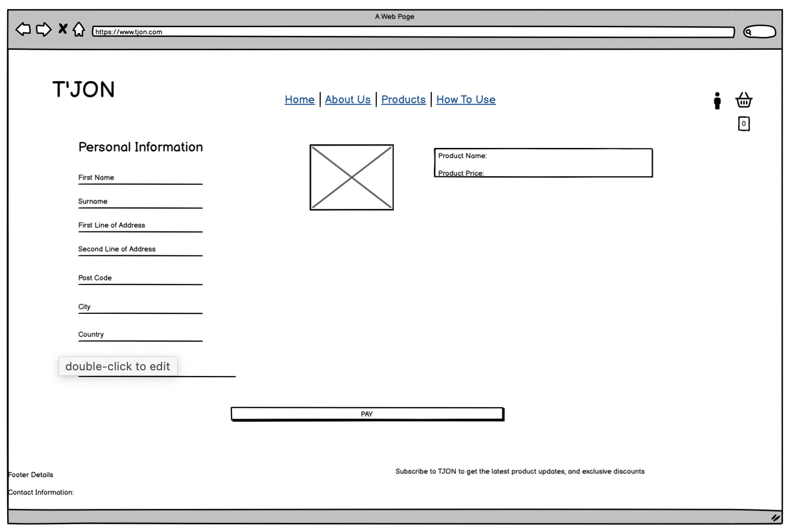
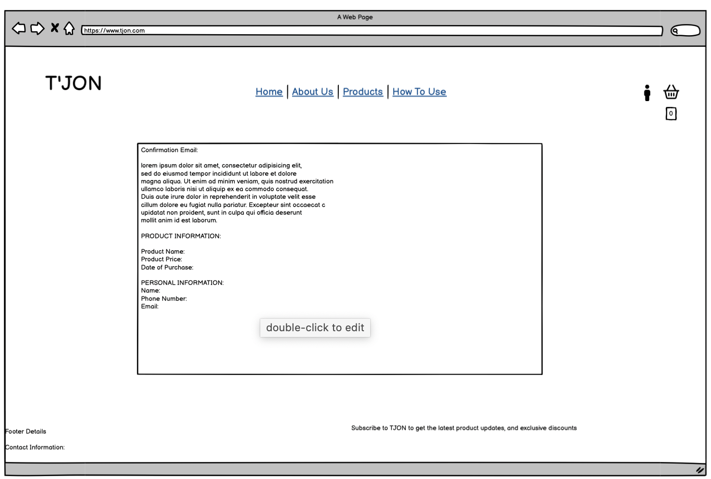

# TJON 
## Online Store Milestone 4 Project

(By | Jeremy Amoako)

[Click to View Site](https://tjon-jeremy-2d2edeca8cbc.herokuapp.com/)

## Introduction 

I have been tasked to build a full-stack site based around business logic used to control a centrally-owned dataset. 

For my Milestone 4 Project I have created and developed a full stack e-commerce site using HTML, CSS, Javascript and Python with Django. Each language I have used has contributed to my TJON site.

TJON is an e-commerce site which sells Natural Skin and Haircare products. The inspiration behind this idea came from my Mother who does exactly that. Hopefully the concepts and values I have learnt from my project can help me in making and actual site for her in the future.

## Background Research 

A lot of design in regards to colours and layout came from Ava Estell which is another Skin and Hair care business.

- [Ava Estell](https://uk.avaestell.com/)

## User Stories 

| As a..  | I want to be able to... | So that I can... |
|---------|-------------------------|------------------|
| First time User  | Immediately understand the purpose of this website | To see if I am going to have any interest in this site |
| First time User  | Easily navigate through the website  | Find out in as little time as possible whether I am going to need any goods or services from this site |
| Shopper   | View a list of products with their price  | See which products I can afford and further click on to see more information about the product |
| Shopper   | Have a more detailed view of a product. | Identify the products price, description, rating, reviews, size and quantity  |
| Shopper   | Have a shopping bag which tells me how much I am spending | To be aware of my purchases and to see if I am on or have gone over budget. |
| Shopper   | Filter and sort what products I actually want | To narrow down a big selection to help me make a decision on what I want |
| Shopper   | Search for key words or ingredients | To select specific products with the ingredients that I want |
| Shopper   | Have a selection of sizes for my product and quantity  | To exactly tailor what I need from the site |
| Shopper   | Update and remove items from my shopping bag | Reach a decision faster on what I need and instead of going back to a products page to refill an order. |
| Shopper   | View any discounts or promo codes  | Ensure that I get the best value as a customer on the website |
| Shopper  | See how much I need to spend to get free shipping. | Ensure that I get the best value as a customer on the website |
| Shopper  | Make a secure payment online | Buy the selected products from the store |
| Shopper  | Get a confirmation of my order | Have a receipt to check over my purchases in the rare case of a mistake |
| Shopper   | Have access to customer service or staff | Incase I run into of any difficulties |
| Returning User  | Be able to login and sign up | To have my details and purchases saved onto the website |
| Returning User  | Be able to logout | Don't have my profile details sitting around on the website |
| Returning User  | See my past activity | View and check previous purchases incase i would like to purchase the same products again|
| Returning User  | Ensure my email is verified by the site | Be confident that the site I am using is secure and nobody can access my details |
| Shopper/ Returning User  | Save my billing details  | Shop quicker and more effectively on my next purchase |
| Shopper/ Returning User  | Save my shipping information | Shop quicker and more effectively on my next purchase |
| Shopper/ Returning User  | Be able to checkout without registering for an account | Purchase with the website without them holding onto my personal information. |
| Store Owner / Staff Member   | Add a product onto the site | Interest new or returing customers with new products |
| Store Owner / Staff Member   | Edit and Update a product | Change different details about certain products  |
| Store Owner / Staff Member   | Delete a product | Get rid of any products that I feel do not need to be on the website anymore |
| Store Owner / Staff Member   | Manage Stock Levels  | Keep track of available inventory |
| Store Owner / Staff Member   | Update any discount codes or promo codes | Entice customers demand on particular products. |

## Wireframes

- All my wireframes were created on [Balsamiq](https://balsamiq.com/)

<details><summary>Index Page</summary>

</details>

<details><summary>Products Page</summary>

</details>

<details><summary>Product Detail Page</summary>

</details>

<details><summary>Bag Page</summary>

</details>

<details><summary>Checkout Page</summary>

</details>

<details><summary>Checkout Success Page</summary>

</details>

## Website Design 

### Typography 

I used Archivo as the main font throughout the website as I liked the simplicity of the font. 
I played around with the font weight and applied more weight to the more important features of the site for example:
- Logo
- Header Section
- Navbar Section
- Buttons
These features were put at a font-weight of 800

Whereas:
- Paragraph Text
- Product Information 
These features were put at a font-weight of 400-500

### Colour Scheme

Because of the sight I was making, I chose to go with a mixture of shades of brown. I wanted the brown to give of a natural atmosphere since the site I was making was selling natural products. I used a white background to give a good contrast between my words.
- rgb(196, 162, 133)
- rgb(63, 34, 11)
- peachpuff
- whitesmoke

## Technologies Used

### Languages

- Python was used for backend development
- Javescript was used for front end interaction
- HTML was used for the main frontend aspect of the site
- CSS was ised for the frontend design and layout of the site

### Frameworks
- Django - Templating language
- jQuery - Simplied Javascript
- Stripe - Payment System
- Bootstrap - Styling and Responsiveness
- Django-AllAuth - User Authentication
- Font Awesome - Icons
- Cripy Forms - Styling Form Inputs
- AWS - Host static and media files
- Boto3 - Connect workspace to AWS S3 Bucket

## Deployment

### ElephantSQL Database

This project uses [ElephantSQL](https://www.elephantsql.com) for the PostgreSQL Database

To get your Postgre Database, sign-up with Github and follow these steps:

1. Click Create New Instance to start a new database
2. Provide a name (this is usually the name of your project)
3. Select the Tiny Turtle (Free) plan
4. Leave the Tags section blank
5. Select the Region closest to you
6. Once created, click on the new database name, where you can view the database URL and password

### Stripe API

This project uses [Stripe](https://stripe.com) to handle the ecommerce payments.

Once you've created a Stripe account and logged-in, follow these series of steps to get your project connected.

- From your Stripe dashboard, click to expand the "Get your test API keys".
- You'll have two keys here:
	- `STRIPE_PUBLIC_KEY` = Publishable Key (starts with **pk**)
	- `STRIPE_SECRET_KEY` = Secret Key (starts with **sk**)

As a backup, in case users prematurely close the purchase-order page during payment, we can include Stripe Webhooks.

- From your Stripe dashboard, click **Developers**, and select **Webhooks**.
- From there, click **Add Endpoint**.
	- `https://tjon-jeremy-2d2edeca8cbc.herokuapp.com/checkout/wh/`
- Click **receive all events**.
- Click **Add Endpoint** to complete the process.
- You'll have a new key here:
	- `STRIPE_WH_SECRET` = Signing Secret (Wehbook) Key (starts with **wh**)

### Amazon AWS

This project uses [AWS](https://aws.amazon.com) to store media and static files online, due to the fact that Heroku doesn't persist this type of data.

Once you've created an AWS account and logged-in, follow these series of steps to get your project connected.
Make sure you're on the **AWS Management Console** page.

#### S3 Bucket

- Search for **S3**.
- Create a new bucket, give it a name (matching your Heroku app name), and choose the region closest to you.
- Uncheck **Block all public access**, and acknowledge that the bucket will be public (required for it to work on Heroku).
- From **Object Ownership**, make sure to have **ACLs enabled**, and **Bucket owner preferred** selected.
- From the **Properties** tab, turn on static website hosting, and type `index.html` and `error.html` in their respective fields, then click **Save**.
- From the **Permissions** tab, paste in the following CORS configuration:
```shell
	[
		{
			"AllowedHeaders": [
				"Authorization"
			],
			"AllowedMethods": [
				"GET"
			],
			"AllowedOrigins": [
				"*"
			],
			"ExposeHeaders": []
		}
	]
	```

- Copy your **ARN** string.
- From the **Bucket Policy** tab, select the **Policy Generator** link, and use the following steps:
	- Policy Type: **S3 Bucket Policy**
	- Effect: **Allow**
	- Principal: `*`
	- Actions: **GetObject**
	- Amazon Resource Name (ARN): **paste-your-ARN-here**
	- Click **Add Statement**
	- Click **Generate Policy**
	- Copy the entire Policy, and paste it into the **Bucket Policy Editor**

		```shell
		{
			"Id": "Policy1234567890",
			"Version": "2012-10-17",
			"Statement": [
				{
					"Sid": "Stmt1234567890",
					"Action": [
						"s3:GetObject"
					],
					"Effect": "Allow",
					"Resource": "arn:aws:s3:::your-bucket-name/*"
					"Principal": "*",
				}
			]
		}
		```
- Before you click "Save", add `/*` to the end of the Resource key in the Bucket Policy Editor (like above).
- Click **Save**.
- From the **Access Control List (ACL)** section, click "Edit" and enable **List** for **Everyone (public access)**, and accept the warning box.
- If the edit button is disabled, you need to change the **Object Ownership** section above to **ACLs enabled** (mentioned above).

#### IAM

Back on the AWS Services Menu, search for and open **IAM** (Identity and Access Management).
Once on the IAM page, follow these steps:

- From **User Groups**, click **Create New Group**.
	- Suggested Name: `group-little-riders-academy` (group + the project name)
- Tags are optional, but you must click it to get to the **review policy** page.
- From **User Groups**, select your newly created group, and go to the **Permissions** tab.
- Open the **Add Permissions** dropdown, and click **Attach Policies**.
- Select the policy, then click **Add Permissions** at the bottom when finished.
- From the **JSON** tab, select the **Import Managed Policy** link.
	- Search for **S3**, select the `AmazonS3FullAccess` policy, and then **Import**.
	- You'll need your ARN from the S3 Bucket copied again, which is pasted into "Resources" key on the Policy.

		```shell
		{
			"Version": "2012-10-17",
			"Statement": [
				{
					"Effect": "Allow",
					"Action": "s3:*",
					"Resource": [
						"arn:aws:s3:::your-bucket-name",
						"arn:aws:s3:::your-bucket-name/*"
					]
				}
			]
		}
		```
- Click **Review Policy**.
- Suggested Name: `policy-tjon-jeremy` (policy + the project name)
- Provide a description:
- "Access to S3 Bucket for tjon-jeremy static files."
	- Click **Create Policy**.
- From **User Groups**, click your "group-tjon-jeremy".
- Click **Attach Policy**.
- Search for the policy you've just created ("policy-tjon-jeremy") and select it, then **Attach Policy**.
- From **User Groups**, click **Add User**.
	- Suggested Name: `user-tjon-jeremy` (user + the project name)
- For "Select AWS Access Type", select **Programmatic Access**.
- Select the group to add your new user to: `group-tjon-jeremy`
- Tags are optional, but you must click it to get to the **review user** page.
- Click **Create User** once done.
- You should see a button to **Download .csv**, so click it to save a copy on your system.
	- **IMPORTANT**: once you pass this page, you cannot come back to download it again, so do it immediately!
	- This contains the user's **Access key ID** and **Secret access key**.
	- `AWS_ACCESS_KEY_ID` = **Access key ID**
	- `AWS_SECRET_ACCESS_KEY` = **Secret access key**

#### Final AWS Setup

- If Heroku Config Vars has `DISABLE_COLLECTSTATIC` still, this can be removed now, so that AWS will handle the static files.
- Back within **S3**, create a new folder called: `media`.
- Select any existing media images for your project to prepare them for being uploaded into the new folder.
- Under **Manage Public Permissions**, select **Grant public read access to this object(s)**.
- No further settings are required, so click **Upload**.

### Gmail API

This project uses [Gmail](https://mail.google.com) to handle sending emails to users for account verification and purchase order confirmations.

Once you've created a Gmail (Google) account and logged-in, follow these series of steps to get your project connected.

- Click on the **Account Settings** (cog icon) in the top-right corner of Gmail.
- Click on the **Accounts and Import** tab.
- Within the section called "Change account settings", click on the link for **Other Google Account settings**.
- From this new page, select **Security** on the left.
- Select **2-Step Verification** to turn it on. (verify your password and account)
- Once verified, select **Turn On** for 2FA.
- Navigate back to the **Security** page, and you'll see a new option called **App passwords**.
- This might prompt you once again to confirm your password and account.
- Select **Mail** for the app type.
- Select **Other (Custom name)** for the device type.
	- Any custom name, such as "Django" or little-riders-academy
- You'll be provided with a 16-character password (API key).
	- Save this somewhere locally, as you cannot access this key again later!
	- `EMAIL_HOST_PASS` = user's 16-character API key
	- `EMAIL_HOST_USER` = user's own personal Gmail email address

### Gmail API

This project uses [Gmail](https://mail.google.com) to handle sending emails to users for account verification and purchase order confirmations.

Once you've created a Gmail (Google) account and logged-in, follow these series of steps to get your project connected.

- Click on the **Account Settings** (cog icon) in the top-right corner of Gmail.
- Click on the **Accounts and Import** tab.
- Within the section called "Change account settings", click on the link for **Other Google Account settings**.
- From this new page, select **Security** on the left.
- Select **2-Step Verification** to turn it on. (verify your password and account)
- Once verified, select **Turn On** for 2FA.
- Navigate back to the **Security** page, and you'll see a new option called **App passwords**.
- This might prompt you once again to confirm your password and account.
- Select **Mail** for the app type.
- Select **Other (Custom name)** for the device type.
	- Any custom name, such as "Django" or little-riders-academy
- You'll be provided with a 16-character password (API key).
	- Save this somewhere locally, as you cannot access this key again later!
	- `EMAIL_HOST_PASS` = user's 16-character API key
	- `EMAIL_HOST_USER` = user's own personal Gmail email address

### Deploying to Heroku

- Select **New** in the top right corner of your Heroku Dashboard, and select **Create New App** from the dropdown menu.
- Your app must be unique, and then choose a region closest to you (EU or USA), finally, select **Create App*.
- From the new app **Settings**, click the **Reveal Config Vars**, and set your enviroment variables.

| Key | Value |
| --- | --- |
| `AWS_ACCESS_KEY_ID` | user's own value |
| `AWS_SECRET_ACCESS_KEY` | user's own value |
| `SECRET_KEY` | user's own value |
| `DATABASE_URL` | user's own value |
| `EMAIL_HOST_PASS` | user's own value |
| `EMAIL_HOST_USER` | user's own value |
| `STRIPE_PUBLIC_KEY` | user's own value |
| `STRIPE_SECRET_KEY` | user's own value |
| `STRIPE_WH_SECRET` | user's own value |
| `USE_AWS` | True |

Heroku now needs two files to allow the user to deploy their project:

- requirements.txt
- Procfile

You can install this project's **requirements** (where applicable) using:
- `pip3 install -r requirements.txt`

If you have your own packages that have been installed, then the requirements file needs to be updated using:
- `pip3 freeze --local > requirements.txt`

The Procfile can be created with the follwoing command:
- `web: gunicorn tjon.wsgi:application` (make sure you use a capital P and also make sure that you use the name of your actual Flask app name, the one at the root-level.)

For Heroku deployment, follow these steps to connect your own GitHub repository to the nearly created app:

Either:
- Select **Automatic Deployment** from the Heroku app.

Or:

- In the Terminal/CLI, connect to Heroku using this command `heroku login -i`
- Set the remote for Heroku: `heroku git:remote -a app_name` (replace **app_name** with your app name)
- After performing the standard Git `add`, `commit`, and `push` to Github, you can now type:
- `git push heroku main`

The project is now connected and deployed to Heroku.

### Local Development

- Create an env.py file and make sure that you list it in your .gitignore file to make sure that any variable listed in your env.py file does not get pushed to Github.

```python
import os 

os.environ['STRIPE_PUBLIC_KEY'] = "user's own value"
os.environ['STRIPE_SECRET_KEY'] = "user's own value"
os.environ['STRIPE_WH_SECRET'] = "user's own value"
os.environ['SECRET_KEY'] = "user's own value"
os.environ['EMAIL_HOST_PASS'] = "user's own value"
os.environ['EMAIL_HOST_USER'] = "user's own value"
os.environ['AWS_ACCESS_KEY_ID'] = "user's own value"
os.environ['AWS_SECRET_ACCESS_KEY'] = "user's own value"
os.environ['DATABASE_URL'] = "user's own value"

# local environment only (do not include these in production/deployment!)
os.environ.setdefault("DEBUG", "True")
```
Once the project is cloned or forked, in order to run it locally, you'll need to follow these steps:

- Start the Django app: `python3 manage.py runserver`
- Stop the app once it's loaded: `CTRL+C` or `⌘+C` (Mac)
- Make any necessary migrations: `python3 manage.py makemigrations`
- Migrate the data to the database: `python3 manage.py migrate`
- Create a superuser: `python3 manage.py createsuperuser`
- Load fixtures (if applicable): `python3 manage.py loaddata file-name.json` (repeat for each file)
- Everything should be ready now, so run the Django app again: `python3 manage.py runserver`

If you'd like to backup your database models, use the following command for each model you'd like to create a fixture for:

- `python3 manage.py dumpdata your-model > your-model.json`
- *repeat this action for each model you wish to backup*

### Forking the Github Repository

1. Open the Github Repository
2. Click the fork button found in the top right corner

### Cloning

1. Open the Github Repository
2. Choose to clone using either HTTPS, SSH, or Github CLI and click the copy button to copy the link address
3. In a code editor, change the current working directory to the location desired for the cloned directory
4. Type 'git clone' into the terminal and paste the link address copied earlier
5. Press enter to clone


## Credits 

- On creation of my project I used the walkthrough project Boutique Ado by [Code Institute](https://learn.codeinstitute.net) as a guidline to help and assist me. Features of the walkthrough project code were taken out or altered to fit the functionality of my project.
- The product descriptions for my products were generated using AI - [ChatGPT(https://chat.openai.com)]

### Media

- All images that were used on the site were created by myself
- The photos taken of the products were taken by my close friend Yannick Ande

### Acknowledgements

- I would like to thank Code Insitute for giving me the opportunity to take on this course
- I would like to thank the tutor support and care for helping me throughout this whole course
- I would like to thank my friends Ore, Kai, Charles for morale support during this course


 

