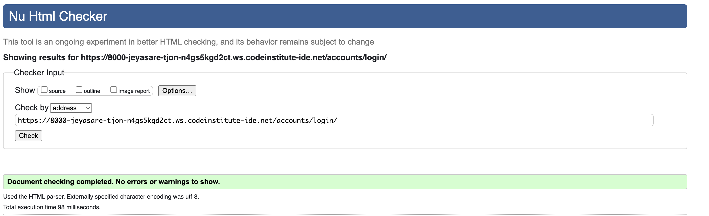
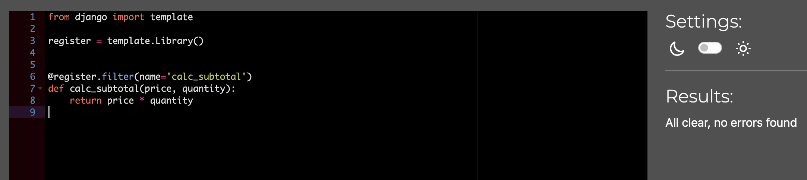
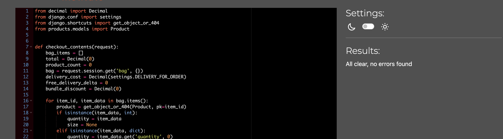
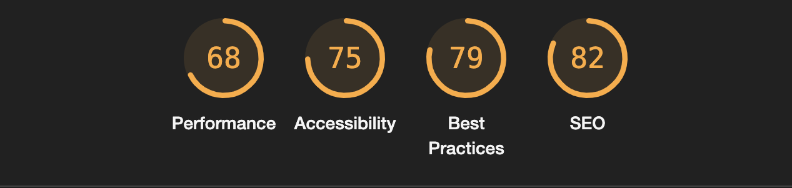
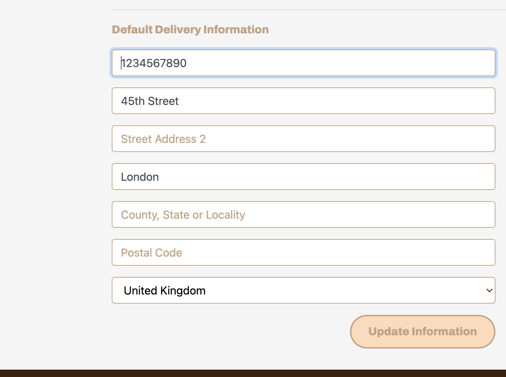
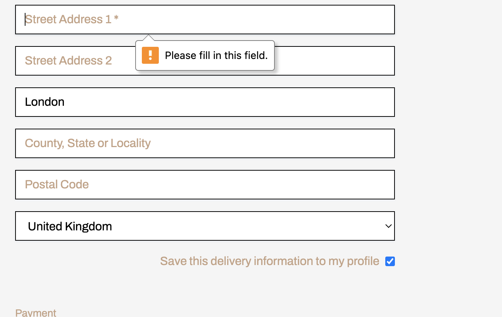

# Testing 

## Code Validation 

### HTML 

| Page | Screenshot | Errors/No Errors |
|------|------------|------------------|
| Home |  | No Errors |
| Products |  | No Errors |
| Product Detail |  | No Errors |
| Bag |  | No Errors |
| Checkout |  | No Errors |
| Checkout Success |  | No Errors |
| Profile |  | No Errors |
| Login |  | No Errors |
| Register |  | No Errors |
| Add Product |  | No Errors |
| Edit Product |  | No Errors |

### CSS

| File | Screenshot | Errors/No Errors |
|------|------------|------------------|
| base.css |  | No Errors |
| checkout.css |  | No Errors |
| profile.css |  | No Errors |

### Javascript 

| File | Screenshot | Errors/No Errors |
|------|------------|------------------|
| countryfield.js |  | No Errors |
| stripe_elements.js |  | No Errors (one undefined variable) |

 ### Python 

| File | Screenshot | Errors/No Errors |
|------|------------|------------------|
| bag apps.py |  | No Errors |
| bag bag_tools.py |  | No Errors |
| bag contexts.py |  | No Errors |
| bag views.py |  | No Errors |
| checkout admin.py |  | No Errors |
| checkout apps.py |  | No Errors |
| checkout contexts.py |  | No Errors |
| checkout forms.py |  | No Errors |
| checkout models.py |  | No Errors |
| checkout signals.py |  | No Errors |
| checkout views.py |  | No Errors |
| checkout webhook_handler.py |  | No Errors |
| checkout webhooks.py |  | No Errors |
| home apps.py |  | No Errors |
| home views.py |  | No Errors |
| products models.py |  | No Errors |
| products views.py |  | No Errors |
| products widgets.py |  | No Errors |
| products admins.py |  | No Errors |
| products apps.py |  | No Errors |
| products forms.py |  | No Errors |
| profiles forms.py |  | No Errors |
| profiles models.py |  | No Errors |
| profiles views.py |  | No Errors |

### Lighthouse

| Page | Desktop | Mobile |
|------|------------|------------------|
| Home |  |  |
| Products |  |  |
| Product Detail |  |  |
| Bag |  |  |
| Checkout |  |  |
| Checkout Success |  |  |
| Profile |  |  |
| Login |  |  |
| Add Product |  |  |
| Edit Product |  |  |

### User Stories 

| User Story | Image |
|------------|-------|
| As a new user to the site, I would like to find out what the business is about and who they are. |  |
| As a new user I would like to see what products the site has to offer. |  |
| As a new user I would like to see in detail product information |  |
| As a returning user I would like to have my shipping details stored so that I can checkout easier when I return |  |
| As a returning user I would like to see my previous activity to see whether I would like to make that purchase again |  |
| As an admin of the site I should be able to add new products to the site |  |
| As an admin of the site I should be able to add edit products to the site |  |
| As an admin of the site I should be able to add delete products to the site |  |

### Defensive Programming 

|  | Expectation | Test | Result | Fix | Screenshot |
|--|-------------|------|--------|-----|------------|
| A user who is not an admin should not be able to add, edit or delete products | The site should deny the request and send an error message | A non admin user tries to access add products page via url | The site should deny the request and resend them back to the page they was on | Test concluded and passed |   |
| A user has to fill in all sections of a form that are starred | The site should pop up with a message to fill in fields which have been left | A user fills out a checkout form without filling in street address | The site should remind user to fill in the field. | Fix |  |
| A user has to fill in the correct email address for them to be allowed to register or sign into the site |  | A user forgets to write the correctly formatted email address | The site doesn't allow user access to the site because of the invalid format | Test concluded and passed |  |
| A customer who purchases any bundle should have a discount of that bundle | If a user purchases a bundle they should get a 10% discount off that bundle | A user purchases a bundle, and they go to the checkout expecting to see a discount | The user should see the discount being taken off the grand total | Test concluded and passed |  |

